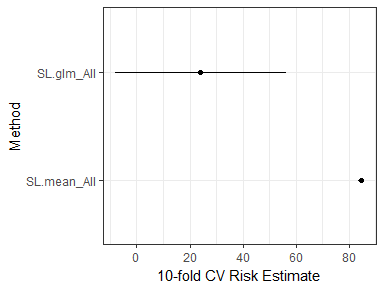

<!-- README.md is generated from README.Rmd. Please edit that file -->
ck37r
=====

[](https://travis-ci.org/ck37/ck37r) [](https://ci.appveyor.com/project/ck37/ck37r/history) [](https://codecov.io/gh/ck37/ck37r) [](https://cran.r-project.org/package=ck37r)

My R toolkit for organizing analysis projects, cleaning data for machine learning, parallelizing code for multiple cores or in a SLURM cluster, and extended functionality for [SuperLearner](http://github.com/ecpolley/SuperLearner) and [TMLE](github.com/cran/tmle). Some of the SuperLearner functions may eventually be migrated into the SuperLearner package.

Installation
------------

Install the [latest release from CRAN](https://cran.r-project.org/package=ck37r):

``` r
install.packages("ck37r") 
```

Install the development version from github:

``` r
# install.packages("devtools")
devtools::install_github("ck37/ck37r")
```

Functions
---------

-   **Project Utilities**
    -   `import_csvs` - import all CSV files in a given directory.
    -   `load_all_code` - source() all R files in a given directory.
    -   `load_packages` - load a list of packages; for the ones that fail it can attempt to install them automatically from CRAN, then load them again.
-   **Machine Learning**
    -   `categoricals_to_factors` - convert numeric categoricals into factors.
    -   `factors_to_indicators` - convert all factors in a dataframe to series of indicators (one-hot encoding).
    -   `impute_missing_values` - impute missing values in a dataframe (median for numerics and mode for factors; or k-nearest neighbors), add missingness indicators.
    -   `missingness_indicators` - return a matrix of missingness indicators for a dataframe, (optionally) omitting any constant or collinear columns.
    -   `rf_count_terminal_nodes` - count the number of terminal nodes in each tree in a random forest. That information can then be used to grid-search the maximum number of nodes allowed in a Random Forest (along with mtry).
    -   `standardize` - standardize a dataset (center, scale), optionally omitting certain variables.
-   **Parallelization**
    -   `parallelize` - starts a multicore or multinode parallel cluster. Automatically detects parallel nodes in a SLURM environment, which makes code work seemlessly on a laptop or a cluster.
    -   `stop_cluster` - stops a cluster started by `parallelize()`.
-   **SuperLearner**
    -   `gen_superlearner` - create a SuperLearner and CV.SuperLearner function setup to transparently use a certain parallelization configuration.
    -   `cvsl_weights` - table of the meta-weight distribution for each learner in a CV.SuperLearner analysis.
    -   `cvsl_auc` - cross-validated AUC for a CV.SuperLearner analysis.
    -   `cvsl_auc_table` - table of cross-validated AUCs for each learner in a SuperLearner ensemble, including SE, CI, and p-value.
    -   `cvsl_plot_roc` - ROC plot with AUC for a CV.SuperLearner analysis.
    -   `plot.SuperLearner` - plot risk estimates and CIs for a SuperLearner, similar to CV.Superlearner except without SL or Discrete SL.
    -   `sl_auc_table` - table of cross-validated AUCs for each learner in a SuperLearner ensemble, including SE, CI, and p-value.
    -   `sl_stderr` - calculate standard error for each learner's risk in SL.
    -   `sl_plot_roc` - ROC curve plot for one learner in an SL ensemble, plus AUC and CI.
    -   `SL.h2o_auto()` - wrapper for h2o's automatic machine learning system, to be added to SuperLearner.
    -   `SL.bartMachine2()` - wrapper for bartMachine, to be added to SuperLearner.
-   **TMLE**
    -   `tmle_parallel` - allows the SuperLearner estimation in TMLE to be customized, esp. to support parallel estimation via mcSuperLearner and snowSuperLearner.
    -   `setup_parallel_tmle` - helper function to start a cluster and setup SuperLearner and tmle\_parallel to use the created cluster.
-   **h2o**
    -   `h2o_init_multinode()` - function to start an h2o cluster on multiple nodes from within R, intended for use on SLURM or other multi-node clusters.

Examples
--------

### Impute missing values

``` r
# Load a test dataset.
data(PimaIndiansDiabetes2, package = "mlbench")

# Check for missing values.
colSums(is.na(PimaIndiansDiabetes2))
#> pregnant  glucose pressure  triceps  insulin     mass pedigree      age 
#>        0        5       35      227      374       11        0        0 
#> diabetes 
#>        0

# Impute missing data and add missingness indicators.
# Don't impute the outcome though.
result = impute_missing_values(PimaIndiansDiabetes2, skip_vars = "diabetes")

# Confirm we have no missing data.
colSums(is.na(result$data))
#>      pregnant       glucose      pressure       triceps       insulin 
#>             0             0             0             0             0 
#>          mass      pedigree           age      diabetes  miss_glucose 
#>             0             0             0             0             0 
#> miss_pressure  miss_triceps  miss_insulin     miss_mass 
#>             0             0             0             0

#############
# K-nearest neighbors imputation

result2 = impute_missing_values(PimaIndiansDiabetes2, type = "knn", skip_vars = "diabetes")

# Confirm we have no missing data.
colSums(is.na(result2$data))
#>      pregnant       glucose      pressure       triceps       insulin 
#>             0             0             0             0             0 
#>          mass      pedigree           age      diabetes  miss_glucose 
#>             0             0             0             0             0 
#> miss_pressure  miss_triceps  miss_insulin     miss_mass 
#>             0             0             0             0
```

### Load packages

This loads a vector of packages, automatically installing any packages that aren't already installed.

``` r
# Load these 4 packages and install them if necessary.
load_packages(c("MASS", "SuperLearner", "tmle", "doParallel"), auto_install = TRUE)
#> Super Learner
#> Version: 2.0-23-9000
#> Package created on 2017-07-20
#> Welcome to the tmle package, version 1.2.0-5
#> 
#> Use tmleNews() to see details on changes and bug fixes
```

### Random Forest: count terminal nodes

``` r
library(SuperLearner)
library(ck37r)

data(Boston, package = "MASS")

set.seed(1)
sl = SuperLearner(Boston$medv, subset(Boston, select = -medv), family = gaussian(),
                  cvControl = list(V = 3),
                  SL.library = c("SL.mean", "SL.glmnet", "SL.randomForest"))
#> Loading required package: glmnet
#> Loading required package: Matrix
#> Loaded glmnet 2.0-13
#> Loading required package: randomForest
#> randomForest 4.6-12
#> Type rfNews() to see new features/changes/bug fixes.

sl
#> 
#> Call:  
#> SuperLearner(Y = Boston$medv, X = subset(Boston, select = -medv), family = gaussian(),  
#>     SL.library = c("SL.mean", "SL.glmnet", "SL.randomForest"), cvControl = list(V = 3)) 
#> 
#> 
#> 
#>                         Risk        Coef
#> SL.mean_All         84.81661 0.000000000
#> SL.glmnet_All       24.98187 0.004386809
#> SL.randomForest_All 12.31160 0.995613191

summary(rf_count_terminal_nodes(sl$fitLibrary$SL.randomForest_All$object))
#>    Min. 1st Qu.  Median    Mean 3rd Qu.    Max. 
#>   125.0   163.0   166.5   166.1   170.0   189.0

max_terminal_nodes = max(rf_count_terminal_nodes(sl$fitLibrary$SL.randomForest_All$object))

max_terminal_nodes
#> [1] 189

# Now run create.Learner() based on that maximum.

# It is often handy to convert to log scale of a hyperparameter before testing a ~linear grid.
# NOTE: -0.7 ~ 0.69 ~ log(0.5) which is the multiplier that yields sqrt(max)
maxnode_seq = unique(round(exp(log(max_terminal_nodes) * exp(c(-0.97, -0.7, -0.45, -0.15, 0)))))
maxnode_seq
#> [1]   7  14  28  91 189

rf = SuperLearner::create.Learner("SL.randomForest", detailed_names = T, name_prefix = "rf",
                             params = list(ntree = 100), # fewer trees for testing speed only.
                             tune = list(maxnodes = maxnode_seq))

sl = SuperLearner(Boston$medv, subset(Boston, select = -medv), family = gaussian(),
                  cvControl = list(V = 3),
                  SL.library = c("SL.mean", "SL.glmnet", rf$names))

sl
#> 
#> Call:  
#> SuperLearner(Y = Boston$medv, X = subset(Boston, select = -medv), family = gaussian(),  
#>     SL.library = c("SL.mean", "SL.glmnet", rf$names), cvControl = list(V = 3)) 
#> 
#> 
#> 
#>                   Risk      Coef
#> SL.mean_All   84.61301 0.0000000
#> SL.glmnet_All 24.34666 0.0000000
#> rf_7_All      19.14433 0.0000000
#> rf_14_All     14.05414 0.0000000
#> rf_28_All     12.31980 0.0000000
#> rf_91_All     10.69819 0.5745715
#> rf_189_All    10.81954 0.4254285
```

### Parallel TMLE

``` r
library(ck37r)
library(tmle)

# Use multiple cores as available.
ck37r::setup_parallel_tmle()

# Basic SL library.
sl_lib = c("SL.mean", "SL.rpart", "SL.glmnet")

# Set a parallel-compatible seed so cross-validation folds are deterministic.
set.seed(1, "L'Ecuyer-CMRG")
result = run_tmle(Y = Y, A = A, W = W, family = "binomial",
                  g.SL.library = sl_lib, Q.SL.library = sl_lib)
```

### SuperLearner AUC

This will return an AUC table for all learners. It does not include Discrete SL or SuperLearner as those require CV.SuperLearner.

``` r
library(SuperLearner)
library(ck37r)

data(Boston, package = "MASS")

set.seed(1)
sl = SuperLearner(Y = as.numeric(Boston$medv > 23),
                  X = subset(Boston, select = -medv),
                  family = binomial(),
                  SL.library = c("SL.mean", "SL.glm"))

sl_auc_table(sl, y = Boston$chas)
#>                   auc         se  ci_lower  ci_upper      p-value
#> SL.mean_All 0.5000000 0.08758016 0.3283460 0.6716540 5.000000e-01
#> SL.glm_All  0.6331605 0.03526965 0.5640333 0.7022878 7.984369e-05
```

### SuperLearner plot of risk estimates

This is similar to CV.SuperLearner's plot except SuperLearner cannot estimate risk for the Discrete SL and SuperLearner, so those must be omitted here.

``` r
library(SuperLearner)
library(ck37r)

data(Boston, package = "MASS")

set.seed(1)
sl = SuperLearner(Boston$medv, subset(Boston, select = -medv),
                  family = gaussian(),
                  SL.library = c("SL.mean", "SL.glm"))

sl
#> 
#> Call:  
#> SuperLearner(Y = Boston$medv, X = subset(Boston, select = -medv), family = gaussian(),  
#>     SL.library = c("SL.mean", "SL.glm")) 
#> 
#> 
#>                 Risk       Coef
#> SL.mean_All 84.56082 0.01915589
#> SL.glm_All  24.13176 0.98084411
plot(sl, y = Boston$chas)
```



### SuperLearner ROC plot

``` r
library(SuperLearner)
library(ck37r)

data(Boston, package = "MASS")

set.seed(1)
sl = SuperLearner(Y = as.numeric(Boston$medv > 23),
                  X = subset(Boston, select = -medv),
                  family = binomial(),
                  SL.library = c("SL.mean", "SL.glm"))

sl
#> 
#> Call:  
#> SuperLearner(Y = as.numeric(Boston$medv > 23), X = subset(Boston, select = -medv),  
#>     family = binomial(), SL.library = c("SL.mean", "SL.glm")) 
#> 
#> 
#>                   Risk       Coef
#> SL.mean_All 0.23511955 0.01260907
#> SL.glm_All  0.09470232 0.98739093

sl_plot_roc(sl, y = Boston$chas)
```


### CV.SuperLearner AUC

This will return the AUC inference for the CV.SuperLearner.

``` r
library(SuperLearner)
library(ck37r)

data(Boston, package = "MASS")

set.seed(1)
cvsl = CV.SuperLearner(Y = as.numeric(Boston$medv > 23),
                       X = subset(Boston, select = -medv),
                       family = binomial(),
                       cvControl = list(V = 2, stratifyCV = T),
                       SL.library = c("SL.mean", "SL.glmnet"))
cvsl_auc(cvsl)
#> $cvAUC
#> [1] 0.9258827
#> 
#> $se
#> [1] 0.01280423
#> 
#> $ci
#> [1] 0.9007869 0.9509786
#> 
#> $confidence
#> [1] 0.95
```

### CV.SuperLearner AUC table

This will return an AUC table for all learners, plus the SuperLearner.

``` r
library(SuperLearner)
library(ck37r)

data(Boston, package = "MASS")

set.seed(1)
y = as.numeric(Boston$medv > 23)
cvsl = CV.SuperLearner(Y = y,
                       X = subset(Boston, select = -medv),
                       family = binomial(),
                       cvControl = list(V = 2, stratifyCV = T),
                       SL.library = c("SL.mean", "SL.glmnet"))
cvsl_auc_table(cvsl, y = y)
#>                     auc         se  ci_lower  ci_upper       p-value
#> SL.mean_All   0.5000000 0.04590129 0.4100351 0.5899649  5.000000e-01
#> SL.glmnet_All 0.9258827 0.01280423 0.9007869 0.9509786 7.051378e-243
#> DiscreteSL    0.9258827 0.01280423 0.9007869 0.9509786 7.051378e-243
#> SuperLearner  0.9258827 0.01280423 0.9007869 0.9509786 7.051378e-243
```

### CV.SuperLearner plot ROC

``` r
library(SuperLearner)
library(ck37r)

data(Boston, package = "MASS")

set.seed(1)
cvsl = CV.SuperLearner(Y = as.numeric(Boston$medv > 23),
                       X = subset(Boston, select = -medv),
                       family = binomial(),
                       cvControl = list(V = 2, stratifyCV = T),
                       SL.library = c("SL.mean", "SL.glmnet"))
cvsl_plot_roc(cvsl)
```


### CV.SuperLearner weight table

Returns summary statistics (mean, sd, min, max) on the distribution of the weights assigned to each learner across SuperLearner ensembles. This makes it easier to understand the stochastic nature of the SL learner weights and to see how often certain learners are used.

``` r
library(SuperLearner)
library(ck37r)

data(Boston, package = "MASS")

set.seed(1)
cvsl = CV.SuperLearner(Y = as.numeric(Boston$medv > 23),
                       X = subset(Boston, select = -medv),
                       family = binomial(),
                       cvControl = list(V = 2, stratifyCV = T),
                       SL.library = c("SL.mean", "SL.glmnet"))
cvsl_weights(cvsl)
#>   # Learner Mean SD Min Max
#> 1 1  glmnet    1  0   1   1
#> 2 2    mean    0  0   0   0
```

More examples to be added.

References
----------

Breiman, L. (2001). Random forests. Machine learning, 45(1), 5-32.

Dudoit, S., & van der Laan, M. J. (2005). Asymptotics of cross-validated risk estimation in estimator selection and performance assessment. Statistical Methodology, 2(2), 131-154.

LeDell, E., Petersen, M., & van der Laan, M. (2015). Computationally efficient confidence intervals for cross-validated area under the ROC curve estimates. Electronic journal of statistics, 9(1), 1583.

Polley EC, van der Laan MJ (2010) Super Learner in Prediction. U.C. Berkeley Division of Biostatistics Working Paper Series. Paper 226. <http://biostats.bepress.com/ucbbiostat/paper266/>

Sing, T., Sander, O., Beerenwinkel, N., & Lengauer, T. (2005). ROCR: visualizing classifier performance in R. Bioinformatics, 21(20), 3940-3941.

van der Laan, M. J., Polley, E. C. and Hubbard, A. E. (2007) Super Learner. Statistical Applications of Genetics and Molecular Biology, 6, article 25. <http://www.degruyter.com/view/j/sagmb.2007.6.issue-1/sagmb.2007.6.1.1309/sagmb.2007.6.1.1309.xml>

van der Laan, M. J., & Rose, S. (2011). Targeted learning: causal inference for observational and experimental data. Springer Science & Business Media.

van der Laan, M. J., & Rubin, D. (2006). Targeted Maximum Likelihood Learning. The International Journal of Biostatistics, 2(1), 1-38.
